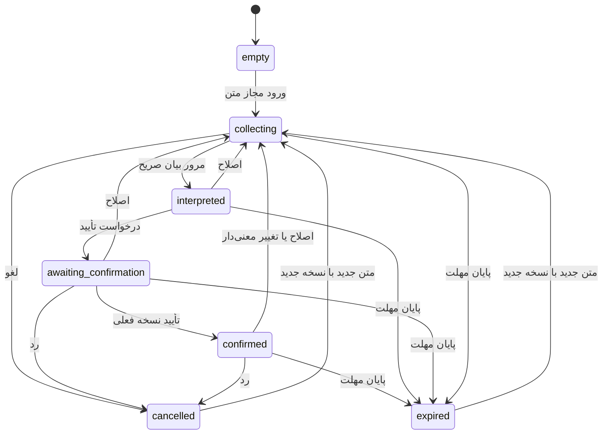

# بنیاد جریان Intent — پیاده‌سازی محدود

تاریخ: ۱۱ سپتامبر ۲۰۲۶ · مالک منطقی: Core · رابط: V2

## دامنه و مبنا

مرجع فنی [معماری V2](20260910_V2_REVIEW/V2_TECHNICAL_ARCHITECTURE_DESIGN.md)، [فهرست کارها](20260910_V2_REVIEW/V2_IMPLEMENTATION_TASKS.md) و [برنامه اجرا](20260910_V2_REVIEW/V2_IMPLEMENTATION_PLAN.md) است. [دستور این مرحله](20260911_INTENT_FLOW_INSTRUCTION.md) محدودتر از برنامه کامل Local Discovery است.

[مبنای دقیق](20260911_ASSISTANT_FOUNDATION_BASELINE.md) از فایل‌های ثبت‌نشده‌ی `C:/mlino v2` گرفته شد، بدون تغییر آن پوشه یا جابه‌جایی شاخه‌اش. این کد Core در پوشه V2 اجرا می‌شود، ولی مالکیت منطقی آن مطابق معماری Core باقی می‌ماند. به V1 وصل نیست و نقش یا حساب کاربر را مجوز سازمانی فرض نمی‌کند.

## مدل و چرخه

پایان نشست از هر حالت، Intent را به empty برمی‌گرداند. empty در حافظه `null` است؛ وضعیت‌های دیگر تنها یک رکورد جاری دارند، نه تاریخچه‌ای از نسخه‌ها. expired/cancelled متن، بازنمایی و تأیید را حذف می‌کنند و فقط شماره نسخه و وضعیت باقی می‌ماند. پایان نشست همان فراداده را هم حذف می‌کند.

`IntentState` شامل وضعیت، revision، متن جاری، بازنمایی صریح، confirmedRevision، confirmedAt، expiresAt و مشکل اعتبارسنجی است. هیچ فیلد دسته‌بندی، امتیاز، business_id یا نتیجه‌ای ندارد.

## بیان صریح، نه تحلیل هوشمند

این بنیاد parser یا مدل معنایی را متصل نمی‌کند. فرمان interpret فقط متن صریح کاربر را با حذف فاصله ابتدا/انتها برای مرور نمایش می‌دهد. UI این محدودیت را می‌گوید. canInterpret قبلی که ناظر به پردازش هوشمند بود false مانده؛ canEditIntent فقط امکان دریافت متن محلی را پس از اجازه و رضایت اعلام می‌کند.

معنی‌دار در دامنه فعلی یعنی تغییر متن غیر از فاصله ابتدا/انتها و یکسان‌سازی CRLF، یا تغییر مهلت. تغییر قیود ساختاری یا بازتفسیر مدل در این مرحله وجود ندارد؛ افزودن آن‌ها بعداً باید همان قاعده revision را حفظ کند. اصلاح صریح بلافاصله تأیید را باطل می‌کند، حتی پیش از تایپ مجدد.

## مرز تأیید و جلوگیری از فرمان دیررس

هر فرمان UI حامل `{generation, revision}` از همان نمایی است که کاربر دیده است. Core پیش از اعمال آن اجازه محلی، رضایت، فعال‌بودن نشست، foreground، ساعت، سقف نشست و token را بررسی می‌کند. شماره نسخه به‌تنهایی کافی نیست: پس از شروع نشست تازه ممکن است همان شماره تکرار شود، ولی generation متفاوت است.

تأیید فقط از awaiting_confirmation به confirmed می‌رود و confirmedRevision دقیقاً برابر revision جاری است. رضایت، مرور، confidence، visibility یا فراخوانی دوباره نمی‌تواند جای تأیید را بگیرد. هیچ selector یا callback برای فعال‌کردن Matching اضافه نشده؛ canMatch و canOpenBusiness بدون استثنا false هستند.

مکث و مخفی‌شدن generation را تغییر می‌دهد و فرمان دیررس را بی‌اثر می‌کند؛ متن جاری در مهلت نشست باقی می‌ماند. visible ادامه نیست. Resume صریح، مهلت و اختیار را دوباره بررسی می‌کند؛ تأیید نسخه بدون تغییر باقی می‌ماند، بدون اختیار Matching.

رد، لغو و انقضای Intent هم generation را عوض می‌کنند؛ بنابراین ویرایش در صف نیز نمی‌تواند متن حذف‌شده را دوباره وارد کند. متن تازه باید از نمای وضعیت جدید و با token جاری ارسال شود.

## اعتبارسنجی و زمان

- متن خالی، بیش از ۲۰۰۰ نویسه یا نویسه کنترلی ممنوع رد می‌شود؛ تأیید قبلی حفظ نمی‌شود.
- مهلت نامعتبر، گذشته، غیرمتناهی یا پس از سقف نشست قابل تأیید نیست.
- مهلت پیش‌فرض همان سقف دو ساعت از آغاز نشست است؛ UI در این مرحله انتخابگر مهلت ندارد، ولی قرارداد فرمان و تست‌ها مهلت کوتاه‌تر را پوشش می‌دهند.
- در `now >= expiresAt` نسخه منقضی است. ساعت روی هر فرمان بررسی می‌شود؛ تایمر تنها محافظ نیست.
- ۳۰ دقیقه بی‌فعالیتی و دو ساعت سقف مطلق Foundation حفظ شده‌اند؛ بازگشت از مکث سقف را تمدید نمی‌کند.
- پایان، رد رضایت، لغو رضایت، خروج از صفحه، reload، کاهش اجازه و انقضای نشست محتوا را پاک می‌کنند. نسخه منقضی یا لغوشده فقط با ورود متن تازه و revision جدید جایگزین می‌شود.

## مرز UI و اثرهای بیرونی

`intent.ts` منطق خالص، `foundation.ts` مرجع اختیار و نشست، `useFoundation.ts` اتصال React به فرمان‌ها و `IntentFoundation.tsx` صرفاً نمایش است. UI هیچ state موازی برای متن یا تاریخچه ندارد. ورودی جدید به handler جست‌وجوی قدیمی وصل نیست.

کل برنامه قدیمی همچنان نقشه، داده آزمایشی و ذخیره ترجیحات خودش را دارد؛ ادعای «کل برنامه بدون persistence یا Matching است» نادرست خواهد بود. مسیر جدید Core/Assistant به هیچ‌یک متصل نشده است. خروج عمدی از دستیار به جست‌وجوی قدیمی، نشست را می‌بندد و متن Intent را منتقل نمی‌کند.

## راستی‌آزمایی و گام بعد

تست‌های دامنه، اتصال محیط، مرز واردات و مرورگر همراه گزارش تحویل هستند. تاریخ اجرای تست قدیمی آفر فقط داخل همان تست ثابت شد؛ موتور Matching و fixture تغییر نکردند.

گام پیشنهادی بعد: بازبینی این بنیاد، سپس در صورت مجوز مستقل طراحی/اتصال بازنمایی معنایی محلی و قیود صریح با حفظ revision و اعلام موارد پشتیبانی‌نشده. این پیشنهاد مجوز شروع Matching، Directory یا اتصال V1 نیست.
