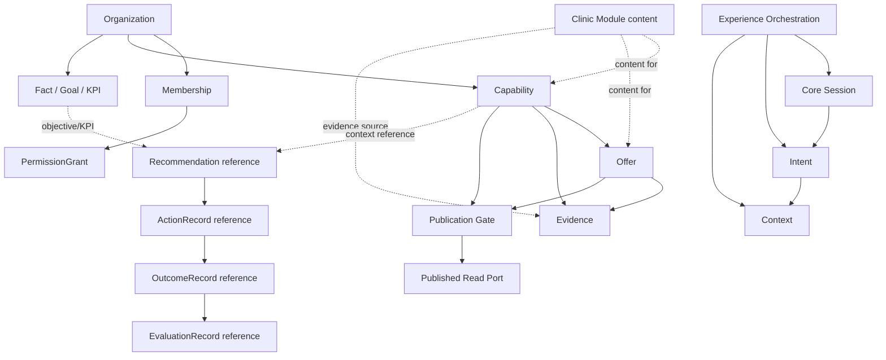

# مشخصات پیاده‌سازی Foundation هستهٔ MLINO

تاریخ: ۲۰۲۶-۰۹-۱۱
نقش: MLINO Backend Foundation Planner
وضعیت: **سند طراحی؛ بدون پیاده‌سازی**

این سند قرارداد اجرایی Phase 1 برای Core را مشخص می‌کند. در این مرحله هیچ کد، شِما، Migration، API عملیاتی یا ADR تغییر نمی‌کند.

## ۱. مبنا و قواعد غیرقابل‌تغییر

مراجع این سند:

- [`MLINO_FIRST_VERTICAL_MVP_SCOPE.md`](MLINO_FIRST_VERTICAL_MVP_SCOPE.md)
- [`MLINO_MVP_IMPLEMENTATION_ROADMAP.md`](MLINO_MVP_IMPLEMENTATION_ROADMAP.md)
- [`ADR-0001`](../docs/architecture/ADR/ADR-0001-v1-as-backbone.md) تا [`ADR-0012`](../docs/architecture/ADR/ADR-0012-experience-assistant-session-boundary.md)

قواعد اجرایی:

- MLINO یک Platform چندVertical است؛ Clinic فقط نخستین Module اجرایی است.
- V1 مالک هویت متعارف Organization و حقیقت ثبت‌شدهٔ کسب‌وکار است.
- Core قرارداد عمومی، چرخهٔ عمر و Gateهای Capability، Offer، Evidence و Publication را تعریف می‌کند.
- Clinic Module vocabulary، content، روش راستی‌آزمایی و workflow صنفی را فراهم می‌کند؛ این Module Entityهای عمومی Core را دوباره نمی‌سازد.
- V2 فقط خروجی Published را از Read Port مصرف می‌کند و Business Truth نمی‌سازد یا تغییر نمی‌دهد.
- Authorization به Membership و Grant تعلق دارد. Role به‌تنهایی Permission نیست.
- Platform می‌تواند اختیار موجود را بررسی و مصرف کند، اما Permission یا Grant جدید ایجاد نمی‌کند.
- Recommendation، ActionRecord، OutcomeRecord و EvaluationRecord موجودیت‌های جدا هستند و در این سند مدل تکراری برای آن‌ها ساخته نمی‌شود.
- `CUSTOMER_DATA` در مدل مفهومی تعریف‌شده اما تا تصویب R8-a از ورود به Business Context مسدود است.
- Capability معتبر اما منتشرنشده می‌تواند در Recommendation داخلی V1 استفاده شود؛ انتشار فقط برای خروج به V2 و تجربهٔ مشتری لازم است.

### ۱.۱ معنای «مالکیت» در این سند

دو سطح باید جدا بمانند:

۱. **مالکیت منطقی:** Core معنا، شناسه، قواعد اعتبار و چرخهٔ عمومی Entity را تعریف می‌کند.

۲. **مالکیت حقیقت و محتوا:** V1 و Module کسب‌وکار رکورد و محتوای واقعی کسب‌وکار را تأمین و نگهداری می‌کنند.

بنابراین مالکیت منطقی Capability یا Offer در Core به معنی انتقال vocabulary یا جدول Clinic به ذخیره‌سازی Core نیست. شکل فیزیکی Persistence در مرحلهٔ جداگانه و با تصمیم معماری مربوط تعیین می‌شود.

## ۲. Entityهای Foundation

### ۲.۱ هویت و اختیار

| Entity | هدف | مالک منطقی | Clinic Module | Future Module | رابطه و چرخهٔ عمر پیشنهادی |
|---|---|---|---|---|---|
| `Organization` / Business Identity | هویت متعارف و پایدار کسب‌وکار | Core/V1 | فقط ارجاع و تکمیل محتوای مجاز | ارجاع | ایجاد → فعال/قابل‌استفاده → آرشیو طبق سیاست آتی؛ نام، دسته یا workspace کلید هویت نیست |
| `Membership` | رابطهٔ عضو با Organization | Core | مصرف‌کنندهٔ وضعیت موجود؛ سازنده نیست | مصرف‌کننده | ایجاد/فعال‌سازی → لغو یا پایان؛ وضعیت آن از Session جداست |
| `PermissionGrant` | اعطای صریح اختیار به Membership | Core و سازوکار Governance | فقط مصرف می‌کند | فقط مصرف می‌کند | اعطا → مصرف → لغو؛ از Role، مالکیت حقوقی یا متن UI به‌صورت ضمنی ساخته نمی‌شود |
| `Session` | حمل بافت هویت و چرخهٔ نشست | Core | Session احرازشده نمی‌سازد | Session احرازشده نمی‌سازد | ایجاد → فعال → بسته/منقضی؛ Session اختیار، Organization یا Grant را جایگزین نمی‌کند |
| `Consent` | ثبت رضایت لازم برای یک تعامل مجاز | Core، با ارجاع به سیاست مربوط | محتوای سیاست را تعیین نمی‌کند | محتوای سیاست را تعیین نمی‌کند | درخواست → اعطا/رد/انقضا/لغو؛ R8-a مرجع رضایت دادهٔ مشتری است و این مفهوم جایگزین آن نیست |

### ۲.۲ Entityهای عمومی حقیقت کسب‌وکار

| Entity | هدف | مالک منطقی | Clinic Module | Future Module | رابطه و چرخهٔ عمر پیشنهادی |
|---|---|---|---|---|---|
| `Capability` | بیان عمومی یک توانمندی قابل‌ارائه با ابعاد توانایی، مخاطب، تأیید و انتشار | Core | vocabulary و محتوای خدمت کلینیک را روی شناسهٔ عمومی فراهم می‌کند | vocabulary و content صنف خود را فراهم می‌کند | ایجاد داخلی → اعتبارسنجی/تأیید → قابل‌انتشار یا داخلی → انتشار → پس‌گرفتن/منقضی‌شدن |
| `Offer` | بیان عمومی قلم، بسته یا کمپین با Scope، نسخه، شرایط و بازهٔ اعتبار | Core | کاتالوگ و محتوای آفر کلینیکی را فراهم می‌کند | کاتالوگ و محتوای صنف خود را فراهم می‌کند | ایجاد نسخه → اعتبار زمانی و Scope → انتشار → انقضا/پس‌گرفتن؛ نسخهٔ قبلی حقیقت تاریخی خود را حفظ می‌کند |
| `Evidence` | ثبت شاهد، منشأ، تازگی و وضعیت تأیید برای یک ادعا | Core | منبع و روش راستی‌آزمایی کلینیکی را فراهم می‌کند | منبع و روش صنفی خود را فراهم می‌کند | ثبت → بررسی/تأیید یا باقی‌ماندن تأییدنشده → تازه/کهنه/پس‌گرفته؛ provenance با confirmation یکی نیست |
| `Publication` | Gate خروج اطلاعات عمومی از حقیقت داخلی به تصویر قابل‌مصرف | Core | محتوای قابل‌انتشار را آماده می‌کند؛ Gate را دور نمی‌زند | محتوای قابل‌انتشار را آماده می‌کند | درخواست Gate → بررسی شروط → Published → Revoked/Expired؛ انتشار خودکار مجاز نیست |

`Publication` در این سند یک Gate و سابقهٔ وضعیت است، نه مجوز جدید و نه اختیار مستقل برای Module. تأیید شرایط انتشار باید با Membership و Grant موجود انجام شود.

### ۲.۳ پایه‌های Business Context در Phase 1

| Entity | هدف | مالک منطقی | Clinic Module | Future Module | رابطه و چرخهٔ عمر پیشنهادی |
|---|---|---|---|---|---|
| `Fact` | بیان «چه چیزی درست است» | Core Context contract و V1 حقیقت | Factهای حوزهٔ Clinic را با منبع معتبر فراهم می‌کند | Factهای حوزهٔ خود را فراهم می‌کند | ثبت → اعتبارسنجی/تأیید → معتبر یا منقضی؛ AI inference بدون تأیید انسانی Fact نمی‌شود |
| `Goal` | بیان «چه می‌خواهیم» | Core Context contract و Organization | هدف‌های کسب‌وکار Clinic را ثبت می‌کند | هدف‌های کسب‌وکار خود را ثبت می‌کند | تعریف → فعال → پایان/لغو/جایگزینی؛ به KPI قابل‌ردیابی متصل می‌شود |
| `KPI` | معیار قابل‌اندازه‌گیری برای Goal یا وضعیت کسب‌وکار | Core Context contract و V1 | مقدار و معنای صنفی را فراهم می‌کند؛ تعریف عمومی را تغییر نمی‌دهد | مقدار و معنای صنفی را فراهم می‌کند | تعریف → اندازه‌گیری → تازه/کهنه؛ عدد بدون منبع و زمان معتبر نیست |
| `Capability` در Context | ارجاع به توانمندی کسب‌وکار | همان Entity عمومی Core | محتوای کلینیکی | محتوای صنفی | Entity جدا ساخته نمی‌شود؛ Context فقط به Capability عمومی ارجاع می‌دهد |

`Observation`، `Signal` و `Decision` در Phase 2 طراحی/پیاده‌سازی می‌شوند. `Recommendation`، `ActionRecord`، `OutcomeRecord` و `EvaluationRecord` نیز lifecycleهای مستقل خود را دارند و در این Phase فقط به‌عنوان reference در روابط دیده می‌شوند.

### ۲.۴ چرخهٔ تجربه و Intent

| Entity | هدف | مالک منطقی | Clinic Module | Future Module | رابطه و چرخهٔ عمر پیشنهادی |
|---|---|---|---|---|---|
| `Intent` | بیان نیاز کاربر در تعامل جاری | Core | معنای صنفی را به Core تحمیل نمی‌کند | مصرف‌کنندهٔ تجربهٔ خود | empty → collecting → interpreted → awaiting confirmation → confirmed؛ سپس expired/cancelled؛ هر تغییر معنادار revision جدید می‌سازد |
| `Context` | قیود قابل‌مشاهدهٔ مرتبط با Intent | Core | فقط vocabulary لازم را از Port می‌گیرد | vocabulary خود را از Port می‌گیرد | ایجاد → اصلاح/تأیید → invalidate/reset؛ تغییر معنادار نتیجهٔ قبلی را باطل می‌کند |
| `ExperienceOrchestration` | هماهنگی چرخهٔ تجربه و مرزهای Core | Core | عملیات صنفی را نمی‌سازد | فقط از مرز عمومی استفاده می‌کند | بدون Business Truth مستقل؛ فقط وضعیت‌ها و Gateها را هماهنگ می‌کند |

در V2، `Session`، `Permission` و `Consent` ممکن است در UI با واژه‌های نزدیک دیده شوند. سند اجرایی باید صریح باشد: حالت محلی دستیار Session احرازشدهٔ Core نیست؛ دروازهٔ محیط Permission Grant سازمانی نیست؛ رضایت شروع گفت‌وگو جای R8-a را نمی‌گیرد. دستیار مشتری اختیار هیچ شخصی را حمل نمی‌کند.

### ۲.۵ موجودیت‌های چرخهٔ عمر که در این Phase تکرار نمی‌شوند

| Entity | هدف | مالک منطقی | Clinic Module | Future Module | رابطه و چرخهٔ عمر پیشنهادی |
|---|---|---|---|---|---|
| `Recommendation` | بیان «چه کاری باید انجام شود» | قرارداد عمومی Core؛ رکورد عملیاتی در V1/موتور مربوط | Evidence و زمینهٔ صنفی می‌دهد؛ موجودیت را دوباره نمی‌سازد | از قرارداد نسخه‌دار استفاده می‌کند | `draft → proposed → accepted/rejected → expired/superseded`؛ چرخه در تصمیم پایان می‌یابد |
| `Decision` | ثبت انتخاب یا رد انسانی دربارهٔ اقدام/پیشنهاد | V1 و Governance روی قرارداد Core | تصمیم درمانی یا پزشکی خارج از این Phase است | مصرف‌کنندهٔ قرارداد عمومی | ایجاد توسط عضو مجاز → ثبت دلیل و مبنا → بسته/جایگزین‌شده؛ دستیار خودکار Decision نمی‌سازد |
| `ActionRecord` | ثبت کاری که تخصیص یا اجرا شده است | V1/مالک اجرای عملیات؛ مستقل از Recommendation | workflow صنفی را پیشنهاد می‌کند؛ اختیار نمی‌دهد | از مرز عمومی استفاده می‌کند | ثبت مبدأ و اختیار → تخصیص/اجرا یا لغو؛ `recommendation_id` در صورت وجود اختیاری است |
| `OutcomeRecord` | ثبت آنچه پس از Action رخ داده است | V1/منبع مستقل اندازه‌گیری | دادهٔ نتیجهٔ صنفی را در صورت مجازبودن فراهم می‌کند | منبع نتیجهٔ خودش را فراهم می‌کند | مشاهده/ثبت مستقل → اصلاح یا منقضی‌شدن طبق منبع؛ Outcome با Action یا Evaluation ادغام نمی‌شود |
| `EvaluationRecord` | ارزیابی مؤثربودن Action/Outcome | قرارداد Core و V1 Learning در مرحلهٔ بعد | شواهد ارزیابی صنفی می‌دهد | شواهد ارزیابی صنفی می‌دهد | ایجاد پس از Outcome → ارزیابی → بازبینی؛ confidence یا completion جای ارزیابی را نمی‌گیرد |

این جدول فقط مرز و رابطه را تثبیت می‌کند. پیاده‌سازی Persistence این Entityها در Phaseهای بعدی و طبق ADR-0005، ADR-0007 و ADR-0008 انجام می‌شود؛ هیچ مدل تکراری با پیشوند `Knowledge` ساخته نمی‌شود.

## ۳. روابط پیشنهادی

این نمودار رابطهٔ مفهومی را نشان می‌دهد؛ هیچ‌یک از خطوط زیر به معنی مجوز ایجاد Schema یا Foreign Key در این مرحله نیست:



قواعد رابطه:

- هر Capability، Offer و Evidence باید به Organization متعارف V1 قابل‌ردیابی باشد.
- Offer بدون Capability واجد شرایط وارد خروجی Matching نمی‌شود.
- Evidence متعلق به همان ادعا یا همان Capability/Offer است؛ Evidence بین گزینه‌های مستقل ترکیب نمی‌شود.
- Publication فقط تصویر مجاز Capability/Offer را به Read Port می‌فرستد.
- Core به جدول Module ارجاع مستقیم نمی‌دهد؛ Module می‌تواند به شناسه‌های Core ارجاع دهد.
- Recommendation و ActionRecord زنجیرهٔ جدا دارند؛ Outcome و Evaluation فیلد پنهان روی Recommendation نیستند.

## ۴. حداقل نیازهای V1 برای اولین جریان ارزش

برای مسیر `Onboarding → Capability → Offer → Publish → Business Action Loop` این موارد لازم‌اند:

۱. **Organization Identity:** یک شناسهٔ پایدار و متعارف در V1، مستقل از نام و مستقل از Clinic Module.

۲. **Membership و PermissionGrant:** نمایندهٔ مجاز باید با Membership و Grant موجود قابل‌شناسایی باشد. Role فقط زمینه است و از آن Grant ضمنی استخراج نمی‌شود. اگر D-57 هنوز عملیاتی نشده باشد، Demo باید Fixture صریح و برچسب‌خورده داشته باشد.

۳. **Capability عمومی Core:** ایجاد Capability با ارجاع به Organization، محتوای صنفی جدا، ابعاد تأیید و انتشار و وضعیت freshness.

۴. **Offer عمومی Core:** نسخه، Scope، شرایط و `valid_from`/`valid_until` باید قابل‌اعتبارسنجی باشند. Offer آینده، منقضی یا تاریخ‌نامعتبر فعال نیست.

۵. **Evidence عمومی Core:** منشأ، زمان، confidence و `confirmedBy` جدا ثبت شوند. `AI_INFERRED` بدون تأیید انسانی Fact یا Capability قابل‌انتشار نمی‌شود.

۶. **Publication Gate:** پیش از اولین انتشار، راستی‌آزمایی هویت طبق D-61، Grant معتبر، Evidence کافی و اعتبار Capability/Offer بررسی شود. لغو و انقضا باید در مصرف بعدی قابل‌تشخیص باشد.

۷. **مصرف داخلی و خروجی عمومی جدا:** V1 می‌تواند Capability معتبر اما منتشرنشده را برای Recommendation داخلی بخواند؛ V2 فقط Published Read Port را می‌خواند.

۸. **Business Action Loop:** Recommendation دلیل، Evidence، Target Role، Priority و Expected Impact دارد؛ Decision و ActionRecord جدا ثبت می‌شوند؛ اجرای خودکار اختیار یا Action بیرونی در این Phase نیست.

۹. **مرز Foundation:** تا پایان Foundation، `canMatch` فعال نمی‌شود و Core به Business Directory، Database Module یا Event Log برای تجربهٔ مشتری متصل نمی‌شود.

## ۵. برنامه‌ریزی Database

### ۵.۱ وضعیت این Phase

این بخش مدل فیزیکی نهایی ارائه نمی‌کند. هیچ جدول، ستون، Index، Migration یا تغییر Prisma در این مرحله مجاز نیست. هدف فقط تعیین نیازهای مفهومی برای طراحی Persistence بعدی است.

### ۵.۲ Entityهای موردنیاز در طراحی Persistence آینده

**هستهٔ هویت و حاکمیت:**

- `Organization`
- `Membership`
- `PermissionGrant`
- سابقهٔ لازم برای لغو Grant و ردیابی تصمیم‌های حاکمیتی، در حدی که ADRهای مربوط تصویب کنند.

**Entityهای عمومی Business Context و Business Truth:**

- `Capability`
- `Offer` و نسخه‌های آن
- `Evidence` و referenceهای آن
- `Publication` یا سابقهٔ Gate انتشار
- `Fact`
- `Goal`
- `KPI`

**حالت تجربه:**

- حالت `Session`، `Intent` و `Context` در MVP مشتری باید session-only بماند؛ ذخیرهٔ بلندمدت یا Transcript در این Phase طراحی نمی‌شود.

**Entityهای خارج از مدل تکراری این Phase:**

- `Recommendation`
- `ActionRecord`
- `OutcomeRecord`
- `EvaluationRecord`

این چهار مورد در Persistence آینده با lifecycle مستقل خود طراحی می‌شوند و نباید با ایجاد `KnowledgeRecommendation`، `KnowledgeAction` یا فیلدهای outcome/evaluation روی Capability یا Recommendation تکثیر شوند.

### ۵.۳ روابطی که Persistence آینده باید حفظ کند

- Organization ← Membership ← PermissionGrant؛
- Organization ← Capability ← Offer؛
- Capability/Offer ← Evidence؛
- Capability/Offer ← Publication Gate؛
- Organization ← Fact/Goal/KPI؛
- Session ← Intent ← Context؛
- Recommendation → ActionRecord → OutcomeRecord → EvaluationRecord، با جدایی Entityها و زمان‌های مستقل؛
- ارتباط workspace یا Business Twin با Organization فقط از قرارداد `ExternalWorkspaceLink` و در V1 انجام می‌شود.

### ۵.۴ چیزهایی که نباید در Core schema وجود داشته باشد

- جدول یا فیلد مخصوص Clinic مانند `Doctor`، `Specialty`، `Treatment`، `Appointment`، `ClinicCapacity`، `ClinicCatalog` یا vocabulary درمانی؛
- دسته‌بندی بستهٔ Clinic یا Verticalهای آینده در Enum/فهرست ثابت Core؛
- جدول‌های Content Studio یا ستون `organization_id` در شِمای Content Studio؛
- جدول Business Directory یا Business Twin مخصوص V2؛
- ذخیرهٔ دادهٔ مشتری، پیام، Transcript یا دادهٔ سلامت؛ `CUSTOMER_DATA` تا R8-a همچنان runtime-blocked است؛
- جدول‌های تکراری برای Recommendation، Action، Outcome و Evaluation؛
- مرجع مستقیم Core به جدول‌های ذخیره‌سازی Clinic یا هر Module دیگر؛
- تغییر در `EventLog`، `domainTag` یا فایل‌های منجمد صرفاً برای این Foundation؛
- تکیه بر `CoreEntity` یا Event Log موجود به‌عنوان جایگزین خاموش برای مدل‌های جدید Capability/Offer؛
- Grant یا Permissionی که از Role، مالکیت، پاسخ Assistant یا وجود یک رکورد کسب‌وکار به‌طور ضمنی ساخته شود.

شکل جداسازی فیزیکی Storage—schema جدا یا Database جدا—در این سند انتخاب نمی‌شود و باید در برنامه‌ریزی Persistence مطابق ADR-0011 و D-71 تعیین شود. اصل قطعی این است که Core به جدول Module وابسته نشود و دادهٔ دامنه‌ای Clinic داخل ذخیره‌سازی Core قرار نگیرد.

## ۶. مرز API و سرویس‌ها

این نام‌ها قرارداد طراحی‌اند، نه API پیاده‌شده.

### ۶.۱ سرویس‌های Core

Core باید سرویس‌های عمومی زیر را عرضه یا تعریف کند:

- **Identity Reference:** resolve و اعتبارسنجی Organization ID متعارف؛ بدون ساخت هویت موازی در Module یا V2.
- **Membership Authorization Check:** بررسی Membership و Grant موجود برای یک عملیات؛ بدون اعطا، اصلاح Grant یا تصمیم‌گیری بر اساس Role تنها.
- **Capability Contract Service:** اعتبارسنجی ساختار و ابعاد عمومی Capability؛ بدون تفسیر vocabulary کلینیک.
- **Offer Contract Service:** اعتبارسنجی نسخه، Scope، شرایط و زمان اعتبار Offer؛ بدون ساخت محتوای صنفی.
- **Evidence Service:** بررسی provenance، freshness، confidence و confirmation؛ `confirmedBy` از provenance جداست.
- **Publication Gate:** ارزیابی شروط عمومی و اجرای Gate فقط پس از دریافت اختیار معتبر؛ بدون اعطای Authorization و بدون انتشار خودکار.
- **Context/Experience Orchestration:** هماهنگی Session، Intent، Context و invalidation؛ بدون Business Truth، Matching یا Business Lookup.
- **Lifecycle Reference Boundary:** ارجاع کنترل‌شده به Recommendation/Action/Outcome/Evaluation بدون ساخت مدل تکراری یا ادغام آن‌ها.

### ۶.۲ سرویس‌های Clinic Module

Clinic Module باید فقط این مسئولیت‌ها را عرضه کند:

- ثبت و versioning واژگان treatment/service کلینیک؛
- تولید محتوای کلینیک برای Capability و Offer عمومی Core؛
- مفاهیم Doctor/Specialist و ویژگی‌های صنفی پروفایل؛
- روش راستی‌آزمایی Evidence کلینیکی؛
- appointment workflow و آداپتور سامانهٔ نوبت، در صورت قرارگرفتن در Scope اجرایی؛
- منطق ظرفیت و Fixture محدود دمو؛
- تولید signal یا recommendation داخلی مربوط به ظرفیت، بدون تغییر در semantics عمومی Core.

Clinic Module نمی‌تواند Permission/Grant، Publication Gate، سازمان متعارف یا Session احرازشدهٔ خودش را بسازد.

### ۶.۳ مصرف V1 و V2

**V1:**

```text
Organization/Membership/Grant
        ↓
Clinic content → Core Capability/Offer/Evidence
        ↓
Core Publication Gate
        ↓
V1 Business Truth + Published Read Port
        ↓
Recommendation → Decision → ActionRecord
```

**V2:**

```text
Intent + Context
        ↓
Published Read Port فقط‌خواندنی
        ↓
Discovery/Matching/Experience در V2
```

V2 نباید Core یا Module را برای ایجاد Capability، Offer، Publication، Permission یا Business Truth فراخوانی نوشتنی کند. V2 فقط دادهٔ Published را مصرف می‌کند و Action Handoff تجربه‌ای آن به‌تنهایی Visit، Lead، Booking، Purchase یا Outcome نیست.

## ۷. قواعد اعتبارسنجی و حفاظت Runtime

- `CUSTOMER_DATA` در مدل مفهومی تعریف‌شده است، اما تا تصویب R8-a هر ورودی با این source باید رد شود؛ هیچ bypass مجاز نیست.
- `AI_INFERRED` فقط provenance است و با confidence بالا به Fact تبدیل نمی‌شود. Promotion به Fact یا Capability قابل‌اعتماد به `confirmedBy` انسانی و قواعد مربوط نیاز دارد.
- `provenance` پاسخ «از کجا آمده» است؛ `confirmedBy` پاسخ «چه کسی آن را تأیید کرده» است.
- Capability یا Offer بدون Organization معتبر، Evidence لازم یا freshness قابل‌اعتماد وارد Published نمی‌شود.
- Offer خارج از بازهٔ اعتبار یا با تاریخ نامعتبر فعال محسوب نمی‌شود.
- Publication برای خروج به V2 لازم است؛ Recommendation داخلی V1 می‌تواند به Capability معتبر اما unpublished ارجاع دهد.
- تغییر معنادار Intent یا Context، هر نتیجهٔ Matching قبلی را invalidate می‌کند و ارزیابی مجدد لازم است.
- Session پایان‌یافته Intent، Context و نتیجهٔ جاری را reset/dispose می‌کند؛ این به معنی تغییر Permission یا Membership نیست.
- Core هیچ تصمیمی دربارهٔ معنای پزشکی، مناسب‌بودن درمان برای بیمار یا ظرفیت زندهٔ کلینیک نمی‌گیرد.

## ۸. ترتیب اجرای بعدی و معیار خروج از طراحی

این سند اجرای کد را آغاز نمی‌کند. بعد از بازبینی و تأیید، ترتیب پیشنهادی چنین است:

۱. نهایی‌سازی قراردادهای Domain برای Entityهای عمومی بدون تغییر ADR.

۲. تطبیق قراردادها با Identity/Membership/Grant واقعی یا Fixture صریح D-57؛ نبود این‌ها نباید پنهان شود.

۳. تعریف CCR کوچک برای Persistence، با تعیین محل فیزیکی Storage طبق D-71.

۴. پیاده‌سازی و تست Domain؛ سپس طراحی Migration مستقل.

۵. پیاده‌سازی API V1 و Published Read Port؛ سپس اتصال محدود V2.

خروج از Phase 1 طراحی زمانی ممکن است که تیم بتواند برای هر Entity پاسخ دهد: مالک منطقی کیست، حقیقت از کجا می‌آید، چه Permissionی مصرف می‌شود، Evidence و freshness چیست، و کدام داده عمداً از Core و V2 خارج می‌ماند. بدون این پاسخ‌ها Database یا API ساخته نشود.

## ۹. موارد حل‌نشده

- وضعیت و صادرکنندهٔ نهایی Organization/Membership/Session و سازوکار لغو Session طبق OD-08؛
- شکل فیزیکی جداسازی Storage Core و Module طبق D-71؛
- جزئیات CCR ثبت vocabulary صنفی و namespace آن؛
- سیاست R8-a برای Customer Data؛ implementation همچنان مسدود است؛
- زمان و روش اتصال Recommendation/Action به Persistence؛
- قرارداد نهایی Publishable Business Information برای مصرف V2؛
- سازوکار کامل Identity Verification پیش از Publication طبق D-61.

این موارد در این سند تصمیم تازه‌ای نمی‌سازند و نباید با حدس در کد یا شِما حل شوند.

من کدکس هستم
