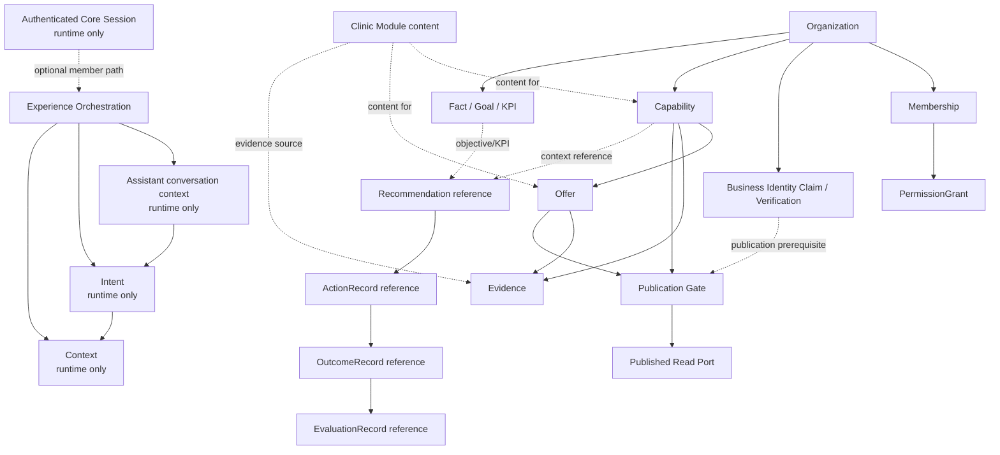

# مشخصات پیاده‌سازی Foundation هستهٔ MLINO

تاریخ: ۲۰۲۶-۰۹-۱۱
نقش: MLINO Backend Foundation Planner
وضعیت: **سند طراحی؛ بدون پیاده‌سازی**

این سند قرارداد اجرایی Phase 1 برای Core را مشخص می‌کند. در این مرحله هیچ کد، شِما، Migration، API عملیاتی یا ADR تغییر نمی‌کند.

## ۱. مبنا و قواعد غیرقابل‌تغییر

مراجع این سند:

- [`MLINO_FIRST_VERTICAL_MVP_SCOPE.md`](MLINO_FIRST_VERTICAL_MVP_SCOPE.md)
- [`MLINO_MVP_IMPLEMENTATION_ROADMAP.md`](MLINO_MVP_IMPLEMENTATION_ROADMAP.md)
- [`ADR-0001`](../docs/architecture/ADR/ADR-0001-v1-as-backbone.md) تا [`ADR-0012`](../docs/architecture/ADR/ADR-0012-experience-assistant-session-boundary.md)

قواعد اجرایی:

- MLINO یک Platform چندVertical است؛ Clinic فقط نخستین Module اجرایی است.
- V1 مالک Organization و حقیقت ثبت‌شدهٔ کسب‌وکار است؛ Organization با Business Identity Claim/Verification یکی نیست.
- Core قرارداد عمومی، چرخهٔ عمر و Gateهای Capability، Offer، Evidence و Publication را تعریف می‌کند.
- Clinic Module vocabulary، content، روش راستی‌آزمایی و workflow صنفی را فراهم می‌کند؛ این Module Entityهای عمومی Core را دوباره نمی‌سازد.
- V2 فقط خروجی Published را از Read Port مصرف می‌کند و Business Truth نمی‌سازد یا تغییر نمی‌دهد.
- Authorization فقط از Membership فعال و Permission Grant فعال می‌آید. Role هرگز منشأ Permission نیست.
- Platform می‌تواند اختیار موجود را بررسی و مصرف کند، اما Permission یا Grant جدید ایجاد نمی‌کند.
- Recommendation، ActionRecord، OutcomeRecord و EvaluationRecord موجودیت‌های جدا هستند و در این سند مدل تکراری برای آن‌ها ساخته نمی‌شود.
- `CUSTOMER_DATA` در مدل مفهومی تعریف‌شده اما تا تصویب R8-a از ورود به Business Context مسدود است.
- Capability معتبر اما منتشرنشده می‌تواند در Recommendation داخلی V1 استفاده شود؛ انتشار فقط برای خروج به V2 و تجربهٔ مشتری لازم است.

### ۱.۱ معنای «مالکیت» در این سند

دو سطح باید جدا بمانند:

۱. **مالکیت منطقی:** Core معنا، شناسه، قواعد اعتبار و چرخهٔ عمومی Entity را تعریف می‌کند.

۲. **مالکیت حقیقت و محتوا:** V1 و Module کسب‌وکار رکورد و محتوای واقعی کسب‌وکار را تأمین و نگهداری می‌کنند.

بنابراین مالکیت منطقی Capability یا Offer در Core به معنی انتقال vocabulary یا جدول Clinic به ذخیره‌سازی Core نیست. شکل فیزیکی Persistence در مرحلهٔ جداگانه و با تصمیم معماری مربوط تعیین می‌شود.

## ۲. Entityهای Foundation

### ۲.۱ هویت و اختیارِ پایدار

| Entity | هدف | مالک منطقی | Clinic Module | Future Module | رابطه و چرخهٔ عمر پیشنهادی |
|---|---|---|---|---|---|
| `Organization` | فضای کاری و هویت متعارف V1 برای نگهداری زمینهٔ کسب‌وکار؛ هویت داخلی پایدارِ سازمان است، نه ادعای کسب‌وکار واقعی | Core/V1 | فقط ارجاع و تکمیل محتوای مجاز | ارجاع | ایجاد آزاد → قابل‌استفاده → آرشیو طبق سیاست آتی؛ ساختن Organization ادعای مالکیت، هویت حقوقی یا یکتایی کسب‌وکار واقعی نیست |
| `BusinessIdentityClaim` / Verification | ادعای اینکه Organization نمایندهٔ کدام کسب‌وکار واقعی است | Core/Governance؛ حقیقت ادعا در V1 | روش و شاهد راستی‌آزمایی صنفی را فراهم می‌کند؛ ادعا را به‌تنهایی تأیید نمی‌کند | روش و شاهد صنفی خود را فراهم می‌کند | هر Claim دارای `identifier_type` از واژگان ثبت‌شده و `identifier_value` نرمال‌شده است؛ چرخهٔ راستی‌آزمایی مفهومی `submitted → under_review → verified / rejected / expired / revoked` دارد؛ چند Claim ممکن است به یک Organization وابسته باشد، اما قید یکتایی مفهومی روی `(identifier_type, identifier_value)` برای Claim راستی‌آزمایی‌شده و فعال برقرار است؛ حداکثر یک Claim فعال برای هر کسب‌وکار واقعی هدف است و راستی‌آزمایی اختیار حکمرانی نمی‌دهد |
| `Membership` | رابطهٔ عضویت یک هویت خارجی با Organization | Core | مصرف‌کنندهٔ وضعیت موجود؛ سازنده نیست | مصرف‌کننده | شامل `identity_provider` و `external_subject` است؛ ایجاد/فعال‌سازی → لغو یا پایان؛ وضعیت آن از Session جداست؛ Core هیچ User داخلی، گذرواژه یا Credential نگه نمی‌دارد |
| `PermissionGrant` | اعطای صریح اختیار به Membership | Core و سازوکار Governance | فقط مصرف می‌کند | فقط مصرف می‌کند | اعطا → فعال → پایان/لغو؛ فقط از مبناهای مصوب؛ از Role، مالکیت حقوقی یا متن UI به‌صورت ضمنی ساخته نمی‌شود |

این جدول فقط موجودیت‌های پایدار هویت و اختیار را توصیف می‌کند. `Session`، `assistant conversation context`، `Intent` و `Context` در مدل پایدار Core نیستند و در بخش ۲٫۴ فقط به‌عنوان اشیای زمان اجرا تعریف می‌شوند. `Consent` نیز تا OD-01 در Phase 1 هیچ Entity، جدول، ذخیره یا چرخهٔ پایدار ندارد.

#### مسیر اعطای Permission

Permission فقط با این زنجیره معتبر است:

```text
Membership فعال
        +
Permission Grant فعال روی همان Membership
        ↓
Permission قابل‌مصرف برای همان عمل
```

Role هرگز منشأ Permission نیست. `ActorContext.role` در بررسی اجازه خوانده نمی‌شود؛ Role فقط برای مسیریابی یا الگوی کپی در لحظهٔ اعطا کاربرد دارد و هیچ پیوند زنده‌ای با Permission ندارد.

مبناهای اعطای مصوب:

- `founding`: اعطاهای عضو مؤسس هنگام ساخت Organization؛
- `member_grant`: اعطا به‌وسیلهٔ عضو دارای Permission اعطا و لغو، فقط در حدود Permissionهای خودش؛
- `designated_succession`: بازیابی بر اساس جانشینی از پیش تعیین‌شده؛
- `ownership_recovery`: بازیابی مالکیت با شاهد بیرونی و کنترل‌های مصوب.

`ADMIN_ACTION` هرگز مبنای اعطای Permission نیست. مدیر Platform و مدل هوش مصنوعی هیچ Permission کسب‌وکاری دریافت نمی‌کنند و راستی‌آزمایی هویت نیز Grant ایجاد نمی‌کند.

کلید Permission یک رشتهٔ ثبت‌شده و قابل‌گسترش است، نه Enum بستهٔ دیتابیس. Registry شامل عمل‌های Core و در آینده عمل‌های فضانام‌دار Module است؛ اضافه‌کردن کلید باید از قرارداد و Governance مربوط عبور کند و هرگز از Role به‌صورت خودکار ساخته نمی‌شود. برای MVP فقط کلیدهای Core لازم‌اند.

حداقل شش Permission لازم برای انتشار V1 عبارت‌اند از: تأیید Capability، انتشار Capability، ساخت Offer، تأیید شرایط Offer، انتشار Offer، و اعطا/لغو Permission. درخواست و رهاسازی Business Identity Claim طبق D-61 یک Permission جداگانه در مرز هویت است. این اعطاها روی Membership فعال ثبت می‌شوند و فهرست فنی و Persistence آن‌ها در اجرای D-57 تعیین می‌شود؛ این سند فقط مسیر و قاعدهٔ مالکیت را تثبیت می‌کند.

### ۲.۲ Entityهای عمومی حقیقت کسب‌وکار

| Entity | هدف | مالک منطقی | Clinic Module | Future Module | رابطه و چرخهٔ عمر پیشنهادی |
|---|---|---|---|---|---|
| `Capability` | بیان عمومی یک توانمندی قابل‌ارائه با ابعاد مستقل توانایی، مخاطب، تأیید و انتشار | Core | vocabulary و محتوای خدمت کلینیک را از راه قرارداد عمومی فراهم می‌کند | vocabulary و content صنف خود را از راه قرارداد عمومی فراهم می‌کند | چهار بُعد مستقل: توانایی `planned/active/retired`، مخاطب `internal/customer_facing`، تأیید طبق ADR-0006، انتشار `unpublished/published/withdrawn`؛ نام، توضیح کوتاه و `category_key` عمومی در قرارداد Core هستند؛ `active + unpublished` معتبر است |
| `Offer` | بیان عمومی قلم، بسته یا کمپین با Scope، نسخه، شرایط و بازهٔ اعتبار | Core | کاتالوگ و محتوای آفر کلینیکی را از راه قرارداد عمومی فراهم می‌کند | کاتالوگ و محتوای صنف خود را از راه قرارداد عمومی فراهم می‌کند | ایجاد نسخه → اعتبار زمانی و Scope → انتشار → انقضا/پس‌گرفتن؛ نسخهٔ قبلی حقیقت تاریخی خود را حفظ می‌کند؛ شکل، شرایط، قیمت یا `on_request` و بازهٔ اعتبار عمومی Core هستند و ارجاع Capability روی نسخه قرار می‌گیرد |
| `Evidence` | ثبت شاهد، منشأ، تازگی و وضعیت تأیید برای یک ادعا | Core | منبع و روش راستی‌آزمایی کلینیکی را فراهم می‌کند | منبع و روش صنفی خود را فراهم می‌کند | ثبت → بررسی/تأیید یا باقی‌ماندن تأییدنشده → تازه/کهنه/پس‌گرفته؛ provenance با confirmation یکی نیست؛ هر Evidence دقیقاً یک مالک تایپ‌شده دارد |
| `Publication` | Gate خروج اطلاعات عمومی از حقیقت داخلی به تصویر قابل‌مصرف | Core | محتوای قابل‌انتشار را آماده می‌کند؛ Gate را دور نمی‌زند | محتوای قابل‌انتشار را آماده می‌کند | درخواست Gate → بررسی شروط → تغییر بُعد انتشار موجودیت به `published` → پس‌گرفتن/انقضا؛ سابقهٔ Publication فقط ممیزی افزایشی است و منبع حقیقت وضعیت جاری نیست؛ انتشار خودکار مجاز نیست |

`Publication` در این سند یک Gate و سابقهٔ ممیزی است، نه مجوز جدید، موجودیت وضعیت‌دار دوم یا اختیار مستقل برای Module. وضعیت جاری فقط روی بُعد انتشار خود Capability/Offer حقیقت دارد؛ سابقهٔ افزایشی Publication فقط ثبت می‌کند چه کسی، چه زمانی، با کدام Grant و با کدام شروط آن وضعیت را ایجاد یا پس گرفته است. تأیید شرایط انتشار باید با Membership و Grant موجود انجام شود.

دادهٔ عمومی لازم برای V2—نام، توضیح کوتاه، `category_key`، شکل Offer، شرایط، قیمت یا `on_request` و بازهٔ اعتبار—جزء قرارداد و تصویر Published در Core است. Module این محتوا را از راه قرارداد مشخص ارائه می‌کند؛ Core هرگز برای ساخت Published Read Port جدول Module را نمی‌خواند. ویژگی‌های صرفاً صنفی، مانند تخصص درمانگر، بیرون از تصویر عمومی پایه می‌مانند.

#### مالکیت روشن Evidence

در مدل مفهومی، هر Evidence دقیقاً به یک موضوع تایپ‌شده تعلق دارد: یا `Capability` یا `Offer`. در طراحی Persistence، این قاعده با ارجاع‌های جداگانهٔ تایپ‌شده یا جدول‌های پیوند جدا برای هر نوع موضوع بیان می‌شود و یک `owner_type + owner_id` چندریختی آزاد مجاز نیست. شاهد راستی‌آزمایی هویت روی سابقهٔ Verification خود `BusinessIdentityClaim` قرار می‌گیرد و وارد جدول عمومی Evidence نمی‌شود. یک شاهد بین موضوع‌های مستقل به‌صورت ضمنی مشترک نمی‌شود؛ اشتراک آینده فقط با قرارداد تایپ‌شدهٔ جداگانه قابل بررسی است.

#### پیش‌شرط‌های کامل Publication Gate

انتشار Capability فقط وقتی ممکن است که هر پنج پیش‌شرط D-52 و پیش‌شرط ششم D-61 هم‌زمان برقرار باشند:

۱. بُعد توانایی Capability برابر `active` باشد؛

۲. بُعد مخاطب برابر `customer_facing` باشد؛

۳. بُعد تأیید `human_confirmed` با `confirmedBy` و Membership و Permission فعالِ قابل‌راستی‌آزمایی باشد؛

۴. حداقل یک Evidence غیراستنتاجی وجود داشته باشد؛

۵. تأیید و Evidence تازه باشند و افق تازگیِ وابسته به Module رعایت شود؛

۶. برای هر کسب‌وکار واقعی، یک Business Identity Claim راستی‌آزمایی‌شدهٔ فعال وجود داشته باشد؛ ساخت Organization یا راستی‌آزمایی، خودبه‌خود اختیار حکمرانی نمی‌سازد.

برای Offer، همهٔ Capabilityها و Offerهای ارجاع‌شده نیز باید منتشرشده و واجد شرایط باشند. پس گرفتن هر Capability یا شاهد بی‌اعتبار باید انتشار وابسته را در جهت امن باطل کند. ساخت نسخهٔ تازهٔ Offer هرگز به‌تنهایی آن را Published نمی‌کند و نیازمند عمل انسانی مجاز است. `withdrawn` با `retired` یا دسترس‌پذیری لحظه‌ای یکی نیست.

### ۲.۳ پایه‌های Business Context در Phase 1

| Entity | هدف | مالک منطقی | Clinic Module | Future Module | رابطه و چرخهٔ عمر پیشنهادی |
|---|---|---|---|---|---|
| `Fact` | بیان «چه چیزی درست است» | Core Context contract و V1 حقیقت | Factهای حوزهٔ Clinic را با منبع معتبر فراهم می‌کند | Factهای حوزهٔ خود را فراهم می‌کند | ثبت → اعتبارسنجی/تأیید → معتبر یا منقضی؛ AI inference بدون تأیید انسانی Fact نمی‌شود |
| `Goal` | بیان «چه می‌خواهیم» | Core Context contract و Organization | هدف‌های کسب‌وکار Clinic را ثبت می‌کند | هدف‌های کسب‌وکار خود را ثبت می‌کند | تعریف → فعال → پایان/لغو/جایگزینی؛ به KPI قابل‌ردیابی متصل می‌شود |
| `KPI` | معیار قابل‌اندازه‌گیری برای Goal یا وضعیت کسب‌وکار | Core Context contract و V1 | مقدار و معنای صنفی را فراهم می‌کند؛ تعریف عمومی را تغییر نمی‌دهد | مقدار و معنای صنفی را فراهم می‌کند | تعریف → اندازه‌گیری → تازه/کهنه؛ عدد بدون منبع و زمان معتبر نیست |
| `Capability` در Context | ارجاع به توانمندی کسب‌وکار | همان Entity عمومی Core | محتوای کلینیکی | محتوای صنفی | Entity جدا ساخته نمی‌شود؛ Context فقط به Capability عمومی ارجاع می‌دهد |

`Observation`، `Signal` و `Decision` در Phase 2 طراحی/پیاده‌سازی می‌شوند. `Recommendation`، `ActionRecord`، `OutcomeRecord` و `EvaluationRecord` نیز lifecycleهای مستقل خود را دارند و در این Phase فقط به‌عنوان reference در روابط دیده می‌شوند.

### ۲.۴ اشیای تجربه در زمان اجرا؛ خارج از موجودیت‌های پایدار Core

اشیای این بخش برای هماهنگی تجربه لازم‌اند، اما Entity پایدار Core نیستند و در Persistence Phase 1 جدول یا رکورد بلندمدت ندارند.

| Entity | هدف | مالک منطقی | Clinic Module | Future Module | رابطه و چرخهٔ عمر پیشنهادی |
|---|---|---|---|---|---|
| `assistant conversation context` | نگهداری موقت گفت‌وگوی جاری دستیار | Runtime در Core/V2؛ پایدار نیست | معنای صنفی را به Core تحمیل نمی‌کند | مصرف‌کنندهٔ تجربهٔ خود | session-only؛ پس از پایان نشست دور ریخته می‌شود و در Core Persistence ثبت نمی‌شود |
| `Session` | حمل موقت بافت هویت و چرخهٔ نشست احرازشده | Runtime احراز هویت؛ پایدار نیست | Session احرازشده نمی‌سازد | Session احرازشده نمی‌سازد | ایجاد → فعال → بسته/منقضی؛ Session اختیار، Organization یا Grant را جایگزین نمی‌کند و در این Phase موجودیت پایدار Core نیست |
| `Intent` | بیان نیاز کاربر در گفت‌وگوی جاری دستیار | Runtime؛ در assistant conversation context | معنای صنفی را به Core تحمیل نمی‌کند | مصرف‌کنندهٔ تجربهٔ خود | empty → collecting → interpreted → awaiting confirmation → confirmed؛ سپس expired/cancelled؛ هر تغییر معنادار revision جدید می‌سازد؛ به Session احرازشدهٔ Core وابسته نیست و پایدار نمی‌شود |
| `Context` | قیود قابل‌مشاهدهٔ مرتبط با Intent | Runtime؛ پایدار نیست | فقط vocabulary لازم را از Port می‌گیرد | vocabulary خود را از Port می‌گیرد | ایجاد → اصلاح/تأیید → invalidate/reset؛ تغییر معنادار نتیجهٔ قبلی را باطل می‌کند و در Core Persistence ذخیره نمی‌شود |
| `ExperienceOrchestration` | هماهنگی چرخهٔ تجربه و مرزهای Core | Core؛ orchestration زمان اجرا | عملیات صنفی را نمی‌سازد | فقط از مرز عمومی استفاده می‌کند | بدون Business Truth مستقل؛ فقط وضعیت‌ها و Gateها را هماهنگ می‌کند |

در V2، `Session`، `Permission` و `Consent` ممکن است در UI با واژه‌های نزدیک دیده شوند. سند اجرایی باید صریح باشد: حالت محلی دستیار، **assistant conversation context** و session-only است و Session احرازشدهٔ Core نیست؛ دروازهٔ محیط Permission، Grant سازمانی نیست؛ رضایت شروع گفت‌وگو جای R8-a را نمی‌گیرد. دستیار مشتری برای شروع گفت‌وگو به Session احرازشدهٔ Core نیاز ندارد و اختیار هیچ شخصی را حمل نمی‌کند. Session احرازشده فقط در مسیر عضو احرازشدهٔ V1 وارد زنجیره می‌شود.

### ۲.۵ موجودیت‌های چرخهٔ عمر که در این Phase تکرار نمی‌شوند

| Entity | هدف | مالک منطقی | Clinic Module | Future Module | رابطه و چرخهٔ عمر پیشنهادی |
|---|---|---|---|---|---|
| `Recommendation` | بیان «چه کاری باید انجام شود» | قرارداد عمومی Core؛ رکورد عملیاتی در V1/موتور مربوط | Evidence و زمینهٔ صنفی می‌دهد؛ موجودیت را دوباره نمی‌سازد | از قرارداد نسخه‌دار استفاده می‌کند | `draft → proposed → accepted/rejected → expired/superseded`؛ چرخه در تصمیم پایان می‌یابد |
| `Decision` | ثبت انتخاب یا رد انسانی دربارهٔ اقدام/پیشنهاد | V1 و Governance روی قرارداد Core | تصمیم درمانی یا پزشکی خارج از این Phase است | مصرف‌کنندهٔ قرارداد عمومی | ایجاد توسط عضو مجاز → ثبت دلیل و مبنا → بسته/جایگزین‌شده؛ دستیار خودکار Decision نمی‌سازد |
| `ActionRecord` | ثبت کاری که تخصیص یا اجرا شده است | V1/مالک اجرای عملیات؛ مستقل از Recommendation | workflow صنفی را پیشنهاد می‌کند؛ اختیار نمی‌دهد | از مرز عمومی استفاده می‌کند | ثبت مبدأ و اختیار → تخصیص/اجرا یا لغو؛ `recommendation_id` در صورت وجود اختیاری است |
| `OutcomeRecord` | ثبت آنچه پس از Action رخ داده است | V1/منبع مستقل اندازه‌گیری | دادهٔ نتیجهٔ صنفی را در صورت مجازبودن فراهم می‌کند | منبع نتیجهٔ خودش را فراهم می‌کند | مشاهده/ثبت مستقل → اصلاح یا منقضی‌شدن طبق منبع؛ Outcome با Action یا Evaluation ادغام نمی‌شود |
| `EvaluationRecord` | ارزیابی مؤثربودن Action/Outcome | قرارداد Core و V1 Learning در مرحلهٔ بعد | شواهد ارزیابی صنفی می‌دهد | شواهد ارزیابی صنفی می‌دهد | ایجاد پس از Outcome → ارزیابی → بازبینی؛ confidence یا completion جای ارزیابی را نمی‌گیرد |

این جدول فقط مرز و رابطه را تثبیت می‌کند. پیاده‌سازی Persistence این Entityها در Phaseهای بعدی و طبق ADR-0005، ADR-0007 و ADR-0008 انجام می‌شود؛ هیچ مدل تکراری با پیشوند `Knowledge` ساخته نمی‌شود.

## ۳. روابط پیشنهادی

این نمودار رابطهٔ مفهومی را نشان می‌دهد؛ هیچ‌یک از خطوط زیر به معنی مجوز ایجاد Schema یا Foreign Key در این مرحله نیست:



قواعد رابطه:

- هر Capability، Offer و Evidence باید به Organization متعارف V1 قابل‌ردیابی باشد.
- Offer بدون Capability واجد شرایط وارد خروجی Matching نمی‌شود.
- Evidence فقط یک مالک تایپ‌شده از میان Capability و Offer دارد؛ شاهد راستی‌آزمایی هویت در سابقهٔ Verification خود Claim می‌ماند و Evidence چندریختی آزاد نیست.
- بُعد انتشار روی Capability/Offer منبع حقیقت وضعیت جاری است؛ Publication فقط Gate و سابقهٔ ممیزی افزایشی آن را ثبت می‌کند و تصویر مجاز را به Read Port متعلق به Core می‌فرستد.
- نام، توضیح کوتاه، `category_key` و فیلدهای عمومی Offer در Core/Published Read Port وجود دارند؛ Core برای تکمیل آن‌ها جدول Module را نمی‌خواند.
- Core به جدول Module ارجاع مستقیم نمی‌دهد؛ Module می‌تواند از راه قرارداد نسخه‌دار به شناسه‌های Core ارجاع دهد.
- Recommendation و ActionRecord زنجیرهٔ جدا دارند؛ Outcome و Evaluation فیلد پنهان روی Recommendation نیستند.

## ۴. حداقل نیازهای V1 برای اولین جریان ارزش

برای مسیر `Onboarding → Capability → Offer → Publish → Business Action Loop` این موارد لازم‌اند:

۱. **Organization و Business Identity Claim:** Organization یک فضای کاری با شناسهٔ پایدار و متعارف V1 است. ادعای اینکه این Organization نمایندهٔ کدام کسب‌وکار واقعی است، در `BusinessIdentityClaim` جدا ثبت می‌شود و با `identifier_type` ثبت‌شده و `identifier_value` نرمال‌شده شناخته می‌شود. قید یکتایی مفهومی روی همین جفت برای Claim راستی‌آزمایی‌شده و فعال برقرار است؛ این قید محدودیت فنی خود را دارد و دو نوع شناسهٔ متفاوت را به‌تنهایی یکی نمی‌کند. ساخت Organization ادعای هویت یا مالکیت حقوقی نیست؛ یک Organization می‌تواند چند ادعا داشته باشد و حداکثر یک ادعای راستی‌آزمایی‌شدهٔ فعال برای هر کسب‌وکار واقعی مجاز است.

۲. **Membership و PermissionGrant:** نمایندهٔ مجاز باید با Membership فعال و Grant فعال روی همان Membership قابل‌شناسایی باشد. Role هرگز منشأ Permission نیست و `ActorContext.role` در بررسی اجازه خوانده نمی‌شود. اگر D-57 هنوز عملیاتی نشده باشد، Demo باید Fixture صریح و برچسب‌خورده داشته باشد.

۳. **Capability عمومی Core:** ایجاد Capability با ارجاع به Organization، محتوای صنفی جدا، ابعاد تأیید و انتشار و وضعیت freshness.

۴. **Offer عمومی Core:** نسخه، Scope، شرایط و `valid_from`/`valid_until` باید قابل‌اعتبارسنجی باشند. Offer آینده، منقضی یا تاریخ‌نامعتبر فعال نیست.

۵. **Evidence عمومی Core:** منشأ، زمان، confidence و `confirmedBy` جدا ثبت شوند. `AI_INFERRED` بدون تأیید انسانی Fact یا Capability قابل‌انتشار نمی‌شود.

۶. **Publication Gate:** پیش از اولین انتشار، وجود Business Identity Claim راستی‌آزمایی‌شدهٔ فعال طبق D-61، Grant معتبر، Evidence کافی و اعتبار Capability/Offer بررسی شود. راستی‌آزمایی هویت هرگز Grant یا اختیار حکمرانی ایجاد نمی‌کند. لغو و انقضا باید در مصرف بعدی قابل‌تشخیص باشد.

۷. **مصرف داخلی و خروجی عمومی جدا:** V1 می‌تواند Capability معتبر اما منتشرنشده را برای Recommendation داخلی بخواند؛ V2 فقط Published Read Port را می‌خواند.

۸. **Business Action Loop:** Recommendation دلیل، Evidence، Target Role، Priority و Expected Impact دارد؛ Decision و ActionRecord جدا ثبت می‌شوند؛ اجرای خودکار اختیار یا Action بیرونی در این Phase نیست.

۹. **مرز Foundation:** تا پایان Foundation، `canMatch` فعال نمی‌شود و Core به Business Directory، Database Module یا Event Log برای تجربهٔ مشتری متصل نمی‌شود.

## ۵. برنامه‌ریزی Database

### ۵.۱ وضعیت این Phase

این بخش مدل فیزیکی نهایی ارائه نمی‌کند. هیچ جدول، ستون، Index، Migration یا تغییر Prisma در این مرحله مجاز نیست. هدف فقط تعیین نیازهای مفهومی برای طراحی Persistence بعدی است.

### ۵.۲ Entityهای موردنیاز در طراحی Persistence آینده

**هستهٔ هویت و حاکمیت:**

- `Organization`
- `BusinessIdentityClaim` با `identifier_type`، `identifier_value` نرمال‌شده و سابقهٔ چرخهٔ Verification آن
- `Membership` با ارجاع `(identity_provider, external_subject)`؛ بدون User داخلی و بدون Credential
- `PermissionGrant`
- سابقهٔ لازم برای لغو Grant و ردیابی تصمیم‌های حاکمیتی، در حدی که ADRهای مربوط تصویب کنند.

**Entityهای عمومی Business Context و Business Truth:**

- `Capability`
- `Offer` و نسخه‌های تغییرناپذیر آن؛ ارجاع Capability روی نسخه
- `Evidence` با مالکیت تایپ‌شدهٔ جدا برای Capability یا Offer
- وضعیت انتشار روی Capability/Offer و سابقهٔ افزایشی Gate انتشار؛ Publication منبع حقیقت دوم نیست
- تصویر منطقیِ Published Business Information و Read Port متعلق به Core برای دادهٔ عمومی موردنیاز V2
- `Fact`
- `Goal`
- `KPI`

**حالت تجربه:**

- `Session`، `assistant conversation context`، `Intent` و `Context` فقط اشیای زمان اجرا هستند؛ هیچ‌کدام Entity یا جدول پایدار Core نیستند. در MVP مشتری session-only می‌مانند و ذخیرهٔ بلندمدت یا Transcript در این Phase طراحی نمی‌شود.
- `Consent` عمداً در Persistence Phase 1 وجود ندارد. رضایت انتشار همان عمل انتشار توسط عضو مجاز برای شیء مشخص است و رضایت آغاز گفت‌وگو فقط در assistant conversation context و به‌صورت session-only می‌ماند. مدل Consent داده‌ای پس از تصمیم OD-01 طراحی می‌شود.

**Entityهای خارج از مدل تکراری این Phase:**

- `Recommendation`
- `ActionRecord`
- `OutcomeRecord`
- `EvaluationRecord`

این چهار مورد در Persistence آینده با lifecycle مستقل خود طراحی می‌شوند و نباید با ایجاد `KnowledgeRecommendation`، `KnowledgeAction` یا فیلدهای outcome/evaluation روی Capability یا Recommendation تکثیر شوند.

### ۵.۳ روابطی که Persistence آینده باید حفظ کند

- Organization ← Membership ← PermissionGrant؛
- Organization ← BusinessIdentityClaim/Verification؛ Claim دارای `(identifier_type, identifier_value)` نرمال‌شده است و قید یکتایی جزئی برای Claim راستی‌آزمایی‌شده و فعال دارد؛
- Organization ← Capability ← Offer؛
- Capability/Offer ← Evidence با ارجاع تایپ‌شده و دقیقاً یک مالک؛
- Capability/Offer ← بُعد انتشار؛ Publication فقط سابقهٔ Gate و ممیزی افزایشی است؛
- Organization ← Fact/Goal/KPI؛
- Recommendation → ActionRecord → OutcomeRecord → EvaluationRecord، با جدایی Entityها و زمان‌های مستقل؛
- ارتباط workspace یا Business Twin با Organization فقط از قرارداد `ExternalWorkspaceLink` و در V1 انجام می‌شود.

**روابط زمان اجرا که Persistence آینده نباید ذخیره کند:**

- `assistant conversation context ← Intent ← Context`؛ هر سه session-only هستند؛
- Session احرازشدهٔ Core فقط در مسیر عضو احرازشده و به‌صورت اختیاری وارد orchestration می‌شود؛ در این Phase برای آن Entity پایدار Core طراحی نمی‌شود.

### ۵.۴ چیزهایی که نباید در Core schema وجود داشته باشد

- جدول یا فیلد مخصوص Clinic مانند `Doctor`، `Specialty`، `Treatment`، `Appointment`، `ClinicCapacity`، `ClinicCatalog` یا vocabulary درمانی؛
- ادغام Business Identity Claim یا Verification با Organization؛ Claim باید رکورد و تاریخچهٔ مستقل داشته باشد؛
- User داخلی، گذرواژه یا Credential در Core؛ Membership فقط به `(identity_provider, external_subject)` ارجاع می‌دهد؛
- دسته‌بندی بستهٔ Clinic یا Verticalهای آینده در Enum/فهرست ثابت Core؛
- جدول‌های Content Studio یا ستون `organization_id` در شِمای Content Studio؛
- جدول Business Directory یا Business Twin مخصوص V2؛
- نبودن دادهٔ عمومی لازم برای V2 در Core یا هر طراحی که Core را وادار به خواندن جدول Module کند؛
- ذخیرهٔ دادهٔ مشتری، پیام، Transcript یا دادهٔ سلامت؛ `CUSTOMER_DATA` تا R8-a همچنان runtime-blocked است؛
- مالک چندریختی آزاد برای Evidence مانند `owner_type + owner_id`؛ مالکیت باید تایپ‌شده و دقیقاً یکی باشد؛
- جدول‌های تکراری برای Recommendation، Action، Outcome و Evaluation؛
- مرجع مستقیم Core به جدول‌های ذخیره‌سازی Clinic یا هر Module دیگر؛ Core فقط قرارداد محتوای عمومی و Read Port متعلق به Core را مصرف می‌کند؛
- تغییر در `EventLog`، `domainTag` یا فایل‌های منجمد صرفاً برای این Foundation؛
- تکیه بر `CoreEntity` یا Event Log موجود به‌عنوان جایگزین خاموش برای مدل‌های جدید Capability/Offer؛
- Grant یا Permissionی که از Role، مالکیت، پاسخ Assistant یا وجود یک رکورد کسب‌وکار به‌طور ضمنی ساخته شود.

شکل جداسازی فیزیکی Storage—schema جدا یا Database جدا—در این سند انتخاب نمی‌شود و باید در برنامه‌ریزی Persistence مطابق ADR-0011 و D-71 تعیین شود. اصل قطعی این است که Core به جدول Module وابسته نشود و دادهٔ دامنه‌ای Clinic داخل ذخیره‌سازی Core قرار نگیرد.

## ۶. مرز API و سرویس‌ها

این نام‌ها قرارداد طراحی‌اند، نه API پیاده‌شده.

### ۶.۱ سرویس‌های Core

Core باید سرویس‌های عمومی زیر را عرضه یا تعریف کند:

- **Organization Identity Reference:** resolve و اعتبارسنجی Organization ID متعارف؛ ساخت Organization با Business Identity Claim/Verification ادغام نمی‌شود.
- **Business Identity Claim/Verification:** ثبت `identifier_type` و `identifier_value` نرمال‌شده، بررسی چرخهٔ ادعا و خواندن وضعیت آن طبق D-61؛ قید یکتایی Claim فعالِ راستی‌آزمایی‌شده در مرز داده اعمال می‌شود؛ این سرویس Permission، Membership یا اختیار را تغییر نمی‌دهد و بین مدعیان تصمیم‌گیری نمی‌کند.
- **Membership Authorization Check:** نگاشت `(identity_provider, external_subject)` به Membership فعال و بررسی Grant فعال روی همان Membership برای یک عملیات؛ بدون User داخلی، Credential، اعطا یا اصلاح Grant. Role هرگز منشأ Permission نیست و `ActorContext.role` در بررسی اجازه خوانده نمی‌شود.
- **Capability Contract Service:** اعتبارسنجی ساختار و ابعاد عمومی Capability؛ بدون تفسیر vocabulary کلینیک.
- **Offer Contract Service:** اعتبارسنجی نسخه، Scope، شرایط و زمان اعتبار Offer؛ بدون ساخت محتوای صنفی.
- **Evidence Service:** بررسی provenance، freshness، confidence و confirmation با مالکیت تایپ‌شدهٔ دقیقاً یکی برای Capability یا Offer؛ `confirmedBy` از provenance جداست و شاهد Verification هویت از مسیر سابقهٔ خود Claim می‌آید.
- **Publication Gate و Published Read Port:** ارزیابی شروط عمومی و اجرای Gate فقط پس از دریافت اختیار معتبر؛ نگهداری دادهٔ عمومی لازم برای V2 در تصویر متعلق به Core؛ بدون اعطای Authorization، انتشار خودکار یا خواندن جدول Module.
- **Context/Experience Orchestration:** هماهنگی اشیای runtime شامل Session، assistant conversation context، Intent و Context و invalidation؛ بدون تبدیل آن‌ها به Business Truth، Persistence، Matching یا Business Lookup.
- **Lifecycle Reference Boundary:** ارجاع کنترل‌شده به Recommendation/Action/Outcome/Evaluation بدون ساخت مدل تکراری یا ادغام آن‌ها.

### ۶.۲ سرویس‌های Clinic Module

Clinic Module باید فقط این مسئولیت‌ها را عرضه کند:

- ثبت و versioning واژگان treatment/service کلینیک؛
- تولید محتوای عمومی کلینیک برای قرارداد Capability و Offer Core و ارسال آن از راه مرز مشخص؛ Core جدول Module را نمی‌خواند؛
- مفاهیم Doctor/Specialist و ویژگی‌های صنفی پروفایل؛
- روش راستی‌آزمایی Evidence کلینیکی؛
- appointment workflow و آداپتور سامانهٔ نوبت، در صورت قرارگرفتن در Scope اجرایی؛
- منطق ظرفیت و Fixture محدود دمو؛
- تولید signal یا recommendation داخلی مربوط به ظرفیت، بدون تغییر در semantics عمومی Core.

Clinic Module نمی‌تواند Permission/Grant، Publication Gate، Organization متعارف، Business Identity Claim معتبر یا Session احرازشدهٔ خودش را بسازد.

### ۶.۳ مصرف V1 و V2

**V1:**

```text
Organization/Membership/Grant
        ↓
Clinic content → Core Capability/Offer/Evidence
        ↓
Core Publication Gate
        ↓
V1 Business Truth + Published Read Port
        ↓
Recommendation → Decision → ActionRecord
```

**V2:**

```text
Intent + Context
        ↓
Published Read Port فقط‌خواندنی
        ↓
Discovery/Matching/Experience در V2
```

V2 نباید Core یا Module را برای ایجاد Capability، Offer، Publication، Permission یا Business Truth فراخوانی نوشتنی کند. V2 فقط دادهٔ Published را مصرف می‌کند و Action Handoff تجربه‌ای آن به‌تنهایی Visit، Lead، Booking، Purchase یا Outcome نیست.

## ۷. قواعد اعتبارسنجی و حفاظت Runtime

- `CUSTOMER_DATA` در مدل مفهومی تعریف‌شده است، اما تا تصویب R8-a هر ورودی با این source باید رد شود؛ هیچ bypass مجاز نیست.
- `AI_INFERRED` فقط provenance است و با confidence بالا به Fact تبدیل نمی‌شود. Promotion به Fact یا Capability قابل‌اعتماد به `confirmedBy` انسانی و قواعد مربوط نیاز دارد.
- `provenance` پاسخ «از کجا آمده» است؛ `confirmedBy` پاسخ «چه کسی آن را تأیید کرده» است.
- Capability یا Offer بدون Organization معتبر، Evidence لازم یا freshness قابل‌اعتماد وارد Published نمی‌شود.
- Offer خارج از بازهٔ اعتبار یا با تاریخ نامعتبر فعال محسوب نمی‌شود.
- Publication برای خروج به V2 لازم است؛ Recommendation داخلی V1 می‌تواند به Capability معتبر اما unpublished ارجاع دهد.
- تغییر معنادار Intent یا Context، هر نتیجهٔ Matching قبلی را invalidate می‌کند و ارزیابی مجدد لازم است.
- Session پایان‌یافته Intent، Context و نتیجهٔ جاری را reset/dispose می‌کند؛ این به معنی تغییر Permission یا Membership نیست.
- Core هیچ تصمیمی دربارهٔ معنای پزشکی، مناسب‌بودن درمان برای بیمار یا ظرفیت زندهٔ کلینیک نمی‌گیرد.

## ۸. ترتیب اجرای بعدی و معیار خروج از طراحی

این سند اجرای کد را آغاز نمی‌کند. بعد از بازبینی و تأیید، ترتیب پیشنهادی چنین است:

۱. نهایی‌سازی قراردادهای Domain برای Entityهای عمومی بدون تغییر ADR.

۲. تطبیق قراردادها با Identity/Membership/Grant واقعی یا Fixture صریح D-57؛ نبود این‌ها نباید پنهان شود.

۳. تعریف CCR کوچک برای Persistence، با تعیین محل فیزیکی Storage طبق D-71.

این کار باید آگاهانه به دو گام جدا تقسیم شود:

- **CCR اول:** هویت، اختیار و حقیقت عمومی کسب‌وکار شامل Organization، Claim/Verification، Membership، Permission، Capability، Offer، Evidence و وضعیت/تاریخچهٔ Publication.
- **CCR دوم:** Persistence قرارداد Recommendation v1.1 و `ActionRecord` با lifecycle مستقل؛ Outcome و Evaluation نیز طبق ADR-0005 و مسیر مصوب خودشان می‌آیند. این جداسازی از افزودن شتاب‌زدهٔ Entityهای چرخهٔ عمر به CCR هویت و حقیقت کسب‌وکار جلوگیری می‌کند.

۴. پیاده‌سازی و تست Domain؛ سپس طراحی Migration مستقل.

۵. پیاده‌سازی API V1 و Published Read Port؛ سپس اتصال محدود V2.

خروج از Phase 1 طراحی زمانی ممکن است که تیم بتواند برای هر Entity پاسخ دهد: مالک منطقی کیست، حقیقت از کجا می‌آید، چه Permissionی مصرف می‌شود، Evidence و freshness چیست، و کدام داده عمداً از Core و V2 خارج می‌ماند. بدون این پاسخ‌ها Database یا API ساخته نشود.

## ۹. موارد حل‌نشده

- وضعیت و صادرکنندهٔ نهایی Organization/Membership/Session و سازوکار لغو Session طبق OD-08؛
- شکل فیزیکی جداسازی Storage Core و Module طبق D-71؛
- جزئیات CCR ثبت vocabulary صنفی و namespace آن؛
- سیاست R8-a برای Customer Data؛ implementation همچنان مسدود است؛
- زمان و روش اتصال Recommendation/Action به Persistence؛
- قرارداد نهایی Publishable Business Information برای مصرف V2؛
- سازوکار کامل Identity Verification پیش از Publication طبق D-61.

این موارد در این سند تصمیم تازه‌ای نمی‌سازند و نباید با حدس در کد یا شِما حل شوند.

من کدکس هستم
