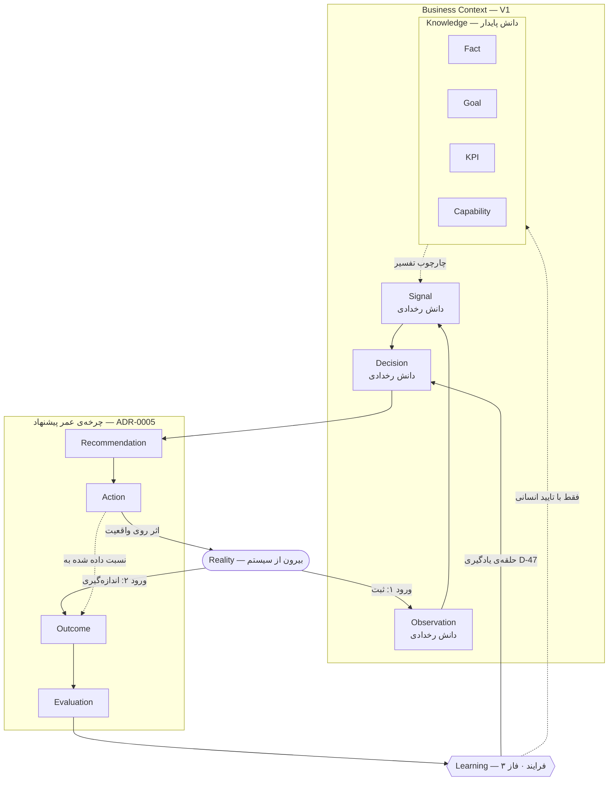

# هم‌ترازی حلقه‌ی دانش — `Reality` · `Knowledge` · `Learning`

**نسخه:** ۱٫۰ · **تاریخ:** ۱۰ سپتامبر ۲۰۲۶
**وضعیت:** `RESOLVED` — OD-30 بسته شد → D-48 · **صفر خط کد، بدون شِما، بدون موجودیت جدید**
**مرجع:** [`BUSINESS_CONTEXT_MODEL.md`](BUSINESS_CONTEXT_MODEL.md) · [`BUSINESS_CONTEXT_PHASE2_DESIGN.md`](BUSINESS_CONTEXT_PHASE2_DESIGN.md) · [`../adr/ADR-0005`](../adr/ADR-0005-recommendation-lifecycle-entity-separation.md)

---

## ۰. خلاصه‌ی تصمیم

```
Reality → Observation → Knowledge → Signal → Decision → Recommendation → Action → Outcome → Evaluation → Learning
```

| نام | گزینه‌ی الف: موجودیت دامنه | گزینه‌ی ب: لایه/فرایند مفهومی | دقیقاً چه |
|---|---|---|---|
| **`Reality`** | ❌ | ✅ | **مرز** — بیرون از سیستم؛ هرگز ذخیره نمی‌شود |
| **`Knowledge`** | ❌ | ✅ | **لایه** — دانش پایدار: `Fact` · `Goal` · `KPI` · `Capability` |
| **`Learning`** | ❌ | ✅ | **فرایند** — فاز ۳؛ ورودی‌اش `Evaluation`، خروجی‌هایش موجودیت‌های موجود |

**هر سه «ب» هستند. هیچ موجودیت جدیدی لازم نیست.**

ولی این سه، سه **گونه‌ی متفاوت** از «ب» هستند — یکی مرز است، یکی لایه، یکی فرایند. یکی دانستنشان همان خطایی است که این سند برای جلوگیری از آن نوشته شده.

---

## ۱. تعاریف

### ۱٫۱ `Reality` — مرز

**آنچه واقعاً در کسب‌وکار و دنیا رخ می‌دهد، بیرون از سیستم.**

MLINO **هرگز واقعیت را نگه نمی‌دارد.** هر چیزی که در سیستم هست، یک **ادعا درباره‌ی واقعیت** است، با منشأ.

همین تمایز است که چند قاعده‌ی مصوب را معنادار می‌کند:

- **مشاهده می‌تواند غلط باشد** — چون با واقعیت مقایسه می‌شود. تغییرناپذیری و جایگزینی (`supersededBy`) دقیقاً برای همین است.
- **ارزیابی ممکن است** — چون نتیجه‌ی اندازه‌گیری‌شده با انتظار مقایسه می‌شود، و هر دو ادعا درباره‌ی یک واقعیت‌اند.
- **«داده‌ی جعلی را به‌عنوان داده‌ی واقعی نمایش نده»** — سیستمی که واقعیت را نگه نمی‌دارد، هرگز حق ندارد یک ادعا را به‌جای واقعیت نشان دهد.

**واقعیت دقیقاً از دو نقطه وارد سیستم می‌شود:**

| نقطه | موجودیت | چه واقعیتی |
|---|---|---|
| **ورود ۱** — پیش از اقدام | `Observation` | آنچه رخ داد |
| **ورود ۲** — پس از اقدام | `OutcomeRecord` | آنچه پس از اقدام ما اندازه‌گیری شد |

این دو **ادغام نمی‌شوند** (ADR-0005): نتیجه واقعیتی است که به یک اقدام **نسبت داده شده**، و همین نسبت‌دادن است که به ارزیابی نیاز دارد.

### ۱٫۲ `Knowledge` — لایه‌ی دانش پایدار

**آنچه کسب‌وکار درباره‌ی خودش می‌داند و می‌خواهد، و پایدار می‌ماند تا جایگزین شود.**

در حلقه، `Knowledge` یعنی **چهار موجودیت فاز ۱**:

```
Fact          چه چیزی درست است
Goal          چه می‌خواهیم
KPI           با چه چیزی می‌سنجیم
Capability    چه کاری از ما برمی‌آید
```

**چرا بین `Observation` و `Signal` می‌نشیند:** سیگنال یک **انحراف** است، و انحراف فقط نسبت به یک چارچوب تعریف می‌شود. «نرخ لغو دو برابر شد» فقط وقتی سیگنال است که یک KPI بگوید پایین‌تر بهتر است و یک هدف بگوید زیر ۵٪. بدون دانش پایدار، مشاهده‌ها فقط عددند.

**پس دانش پایدار مرحله‌ای نیست که مشاهده‌ها از آن عبور کنند؛ چارچوبی است که تفسیر در آن انجام می‌شود.** نماد خطی حلقه برای ارتباط است؛ نمودار بند ۳ رابطه‌ی دقیق را نشان می‌دهد.

### ۱٫۳ `Learning` — فرایند

**فرایندی که ارزیابی نتیجه‌ها را به دانش پایدار و به تصمیم‌های آینده برمی‌گرداند.**

`Learning` همان **حلقه‌ی یادگیری مصوب D-47** است (`Evaluation → Decision آینده`)، با یک نام.

| | چیست |
|---|---|
| **ورودی** | `EvaluationRecord` — آیا مؤثر بود |
| **خروجی ۱** | `Decision` جدید که به ارزیابی استناد می‌کند |
| **خروجی ۲** | تغییر دانش پایدار — `Fact` جایگزین، هدف KPI بازنگری‌شده، توانمندی کنارگذاشته |
| **خروجی ۳** | بازتنظیم آشکارساز — یک `detectorVersion` جدید |

**هر سه خروجی از قبل موجودیت‌های موجودند.** یادگیری چیزی نمی‌سازد که در مدل جا نداشته باشد؛ ترتیب تغییر آن‌ها را تعیین می‌کند.

**قاعده‌ی سخت — همان اصل «استنتاج خودکار حقیقت نیست»:** یادگیری **هرگز خودکار** دانش پایدار را تغییر نمی‌دهد. هر خروجی‌ای که یک `Fact` را جایگزین کند، از همان دروازه‌ی `mayPromoteToFact` و تایید انسانی می‌گذرد. یادگیری خودکار یعنی یک ارزیابی بتواند بی‌صدا واقعیت کسب‌وکار را بازنویسی کند.

**دامنه:** یادگیری **درون یک کسب‌وکار**. یادگیری بین کسب‌وکارها موضوع OD-07 است و این سند آن را حل نمی‌کند → بند ۵٫۲.

---

## ۲. دو معنای «دانش» — قاعده‌ی واژگان

**این مهم‌ترین نتیجه‌ی عملی این سند است.** واژه‌ی «دانش» در MLINO BOOK دو معنای متفاوت پیدا کرده بود:

| معنا | دامنه | کجا |
|---|---|---|
| **گسترده** | هر آیتم دانش — یازده نوع | `KNOWLEDGE_TYPES` · D-31 |
| **باریک** | لایه‌ی چارچوب — چهار نوع | مرحله‌ی `Knowledge` در حلقه |

تصادم واقعی است: در معنای گسترده `signal` خودش **دانش است**؛ در حلقه، `Knowledge` **پیش از** `Signal` می‌آید. اگر هر دو «دانش» خوانده شوند، جمله‌ی «دانش → سیگنال» یعنی سیگنال دانش نیست — که با طبقه‌بندی مصوب تناقض دارد.

### یازده نوع، سه گروه

```
دانش پایدار      fact · goal · kpi · capability              ← مرحله‌ی Knowledge
دانش رخدادی      observation · signal · decision
ارجاع چرخه‌ی عمر  recommendation · action · outcome · evaluation   ← D-37
```

۴ + ۳ + ۴ = ۱۱ ✓

**تفاوت پایدار و رخدادی:** دانش پایدار وضعیت و نیت **کنونی** کسب‌وکار را توصیف می‌کند و چارچوب تفسیر است. دانش رخدادی ثبت می‌کند **کِی** چیزی رخ داد، تشخیص داده شد یا تصمیم گرفته شد. یک تصمیم در `decidedAt` گرفته می‌شود، حتی اگر اثرش ادامه داشته باشد — و می‌تواند دانش پایدار بسازد (`Goal.createdByDecision`، D-41). **رخدادها دانش پایدار را تغییر می‌دهند؛ دانش پایدار رخدادها را تفسیر می‌کند.**

### ✅ شاهد مستقل برای این خوانش

این تقسیم **از پیش در یک تصمیم مصوب دیگر وجود داشت، بی‌آنکه نامی داشته باشد**: فازبندی D-33.

```
فاز ۱ = Fact · Goal · KPI · Capability      = دقیقاً دانش پایدار
فاز ۲ = Observation · Signal · Decision     = دقیقاً دانش رخدادی
```

خوانش من از `Knowledge` از این فازبندی مشتق نشده بود؛ جداگانه به همان مرز رسید. هم‌خوانی دو تصمیم مستقل، شاهد بهتری است از هر استدلالی که فقط در همین سند بیاید.

### قاعده‌ی واژگان در اسناد فارسی

| واژه | معنا | استفاده نشود برای |
|---|---|---|
| **نوع دانش** / **مدل دانش** | طبقه‌بندی یازده‌تایی | مرحله‌ی حلقه |
| **دانش پایدار** | مرحله‌ی `Knowledge` | کل یازده نوع |
| **دانش رخدادی** | مشاهده، سیگنال، تصمیم | — |
| **واقعیت** | فقط `Reality`، بیرون از سیستم | هیچ رکوردی — رکوردها «ثبت واقعیت» یا «ادعا درباره‌ی واقعیت»‌اند |
| **یادگیری** | فرایند | نام هیچ موجودیتی |

**«دانش» بدون صفت برای مرحله‌ی حلقه در MLINO BOOK نوشته نشود.** همان خطر نام‌گذاری که در OD-26 برای «پیشنهاد» ثبت شد.

---

## ۳. نمودار رابطه

⚠️ **پیکان‌ها جریان را نشان می‌دهند، نه جهت ارجاع.** ارجاع ذخیره‌شده همیشه رو به عقب است (طراحی فاز ۲ بند ۰٫۳): تصمیم به سیگنال اشاره می‌کند، نه برعکس.



**چهار چیز که نمودار نشان می‌دهد:**

**۱.** واقعیت دو ورود دارد و یک خروج (`Action`). سیستم روی واقعیت اثر می‌گذارد و اثر را دوباره اندازه می‌گیرد — این است که حلقه را **حلقه** می‌کند و نه یک خط.

**۲.** دانش پایدار با خط‌چین به سیگنال وصل است: **چارچوب** است، نه ورودی.

**۳.** یادگیری به **دو** جا برمی‌گردد — تصمیم و دانش پایدار. دومی خط‌چین است چون از دروازه‌ی تایید انسانی می‌گذرد.

**۴.** `Evidence` در نمودار گره ندارد: **بُعد** است روی هر آیتم (D-45)، نه مرحله در جریان (D-44).

---

## ۴. نگاشت به مفاهیم موجود MLINO BOOK

| مفهوم موجود | نسبت با `Reality` · `Knowledge` · `Learning` | مرجع |
|---|---|---|
| **Business Context** | ظرف کل. `Knowledge` زیرمجموعه‌ی **پایدار** آن است؛ مشاهده، سیگنال و تصمیم هم درون آن‌اند ولی رخدادی‌اند | مدل زمینه بند A |
| **Knowledge Model** | «دانش» در معنای **گسترده** — طبقه‌بندی یازده‌تایی + ابعاد منشأ، تایید، اطمینان، شاهد | D-31 · D-45 · ADR-0006 |
| **Observation** | **ورود ۱ واقعیت** | D-39 |
| **Signal** | تفسیر مشاهده‌ها **در چارچوب** دانش پایدار؛ تنها لایه‌ی مجاز استنتاج | D-42 · D-44 |
| **Decision** | ورودی از دو سو: سیگنال (جریان عملیاتی) و یادگیری (حلقه‌ی یادگیری) | D-47 |
| **Outcome** | **ورود ۲ واقعیت** — واقعیتِ نسبت‌داده‌شده به یک اقدام | ADR-0005 |
| **Evaluation** | **تنها ورودی** `Learning` | ADR-0005 |
| **Learning loops** | همان `Learning` — D-47 و «مسیر یادگیری» بند B مدل زمینه | D-47 |
| **Policy · Role** | موجودیت‌های زمینه (A.۸ · A.۹)، از نظر مفهومی در لایه‌ی پایدار؛ **در `KNOWLEDGE_TYPES` نیستند** و این سند نوع‌بندی‌شان را تعیین نمی‌کند | مدل زمینه |

---

## ۵. تصمیم — موجودیت جدید لازم نیست

### ۵٫۱ آزمون

یک مفهوم فقط وقتی موجودیت می‌گیرد که به **شناسه، منشأ و چرخه‌ی عمرِ خودش** نیاز داشته باشد و هیچ موجودیت موجودی نتواند آن‌ها را حمل کند.

| نام | نتیجه‌ی آزمون |
|---|---|
| `Reality` | **تعریفاً نمی‌تواند ذخیره شود.** هر «موجودیت واقعیت» فقط یک ادعای دیگر بود — یعنی یک `Observation` با نام اشتباه |
| `Knowledge` | چهار موجودیت فاز ۱ از قبل شناسه، منشأ و تازگی دارند. یک موجودیت تجمیعی «Knowledge» فقط **تکرارشان** می‌کرد |
| `Learning` | ورودی (`Evaluation`) و هر سه خروجی از قبل موجودند. یک `LearningRecord` همان کار `EvaluationRecord` را تکرار می‌کرد — **نقض اصل پنجم** |

**پس هر سه «ب» هستند.** همان منطقی که D-34 برای `Relationship` به کار برد: پرهیز از هستان‌شناسی زودهنگام.

### ۵٫۲ ⚠️ تنها جایی که این نتیجه ممکن است عوض شود

**یادگیری بین کسب‌وکارها (OD-07).**

بینشی که از نتیجه‌ی **چند** کسب‌وکار تجمیع شده، به هیچ کسب‌وکار **واحدی** تعلق ندارد. ولی قاعده‌ی C.۱ مدل زمینه می‌گوید **هر** موجودیت زمینه `businessId` اجباری دارد. پس چنین بینشی **نمی‌تواند** `Fact` هیچ کسب‌وکاری باشد.

اگر OD-07 روزی تصویب شود، **احتمالاً یک موجودیت جدید واقعاً لازم می‌شود** — بیرون از زمینه‌ی هر کسب‌وکار و با قواعد حاکمیتی خودش. این اینجا ثبت می‌شود تا کسی بینش بین‌کسب‌وکاری را به‌زور در `Fact` یک کسب‌وکار جا ندهد — که هم نقض مالکیت است و هم یک مسیر نشت داده.

---

## ۶. یک شکاف که این هم‌ترازی آشکار کرد → OD-31

**حلقه‌ی یادگیری مصوب (D-47) در طراحی فاز ۲ قابل بیان نیست.**

```
D-47:                  Evaluation → Decision آینده
Decision.basedOn[]:    Fact / Observation / Signal / KPI     ← EvaluationRecord نیست
```

یعنی تصمیمی که بر پایه‌ی ارزیابی یک اقدام گذشته گرفته شده، **نمی‌تواند به آن ارزیابی استناد کند.** یادگیری در ساختار داده ناپدید می‌شود و فقط در متن `rationale` می‌ماند — که قابل پرس‌وجو نیست.

**این را اصلاح نکردم.** طراحی فاز ۲ مصوب است و تغییر شکل آن بدون بازبینی درست نیست. در OD-31 ثبت شد، با توصیه:

- **افزودن `EvaluationRecord` به `basedOn`** — به‌عنوان **ارجاع** (D-37)، نه تکرار
- **نه `OutcomeRecord`** — نتیجه واقعیتی است که به اقدام ما **نسبت داده شده**؛ استناد به آن بدون ارزیابی یعنی یک ادعای علّی قضاوت‌نشده، که در یادگیری سازمانی دقیقاً همان استدلال «پس از این، پس به‌خاطر این» است. یادگیری باید از ارزیابی بگذرد.
- **نه از راه `Evidence`** — استناد به ارزیابی به‌عنوان شاهد از نوع `record` کار می‌کند ولی مرز را می‌شکند: ارزیابی خودش یک **قضاوت** است، و شاهد طبق D-45 ماده‌ی پشتیبان است نه قضاوت.

---

## ۷. پیامد برای V2 و Business Twin

**V2 فقط زیرمجموعه‌ی قابل‌انتشارِ لایه‌ی دانش پایدار را مصرف می‌کند** — توانمندی، و آفر وقتی OD-26 طراحی شد.

دانش رخدادی (سیگنال، تصمیم)، چرخه‌ی عمر پیشنهاد و یادگیری **هوش داخلی V1 هستند و به V2 نمی‌رسند.** این همان اصل دستور ادامه است: V1 مالک هوش کسب‌وکار، V2 مالک تجربه.

**Business Twin** در V2 یک **تصویر از لایه‌ی پایدارِ قابل‌انتشار** است، نه نسخه‌ای از حلقه. مرز «قابل‌انتشار» موضوع OD-29 است و این سند آن را تعیین نمی‌کند.

---

## ۸. آنچه این سند تصمیم نمی‌گیرد

- **شِما، migration، کد** — طبق قید صریح
- **نوع‌بندی `Policy` و `Role`** در طبقه‌بندی دانش
- **سازوکار یادگیری** — فاز ۳ (D-33)
- **یادگیری بین کسب‌وکارها** — OD-07
- **مرز انتشار به V2** — OD-29
- **اصلاح `Decision.basedOn`** — OD-31، منتظر تصمیم مالک
